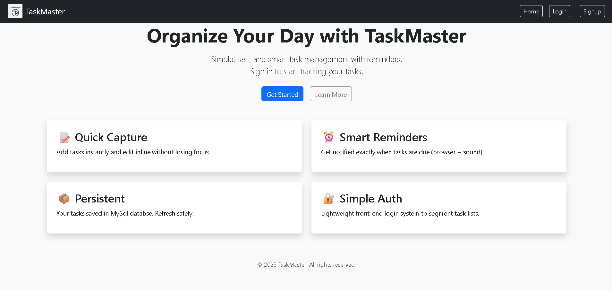

# 📝 TaskMaster1 - Full Stack Task Management App

TaskMaster1 is a full-featured, robust task management web application built with **React**, **Node.js**, **Express**, **MySQL**, **MongoDB**, **HTML**, **CSS**, and **Bootstrap**. It provides users with secure authentication, task management with AI-driven reminders, profile management including image uploads, and a clean, responsive UI.

## 🔗 Live Demo

- **Frontend:** [https://task-master1-sooty.vercel.app/]
- **Backend:** [https://taskmaster-backend-0m81.onrender.com]
- **GitHUb:** [https://github.com/Yaswanth0324/Task-Master1]

## 📂 Project Structure

TaskMaster1/
├── backend/                  # Node.js Express backend
│   ├── server.js             # Server entry file
│   ├── package.json
│   ├── package-lock.json
│   ├── .env                  # Backend environment variables
│   └── node_modules/
├── public/                   # Static frontend files
│   ├── favicon.jpg
│   ├── index.html
│   ├── manifest.json
│   └── robots.txt
├── src/                      # Frontend React source
│   ├── components/           # Reusable UI components
│   │   ├── AuthContext.jsx
│   │   ├── Header.jsx
│   │   └── ProtectedRoute.jsx
│   ├── pages/                # React pages/views
│   │   ├── Home.jsx
│   │   ├── Login.jsx
│   │   ├── Profile.jsx
│   │   ├── Profile.css
│   │   ├── Signup.jsx
│   │   ├── SpeechSynthesis.jsx
│   │   ├── Todo.jsx
│   │   └── Todo.css
│   ├── utils/                # Utility files and app-level CSS
│   │   ├── App.js
│   │   ├── App.css
│   │   ├── index.js
│   │   ├── index.css
│   │   ├── logo.svg
│   │   ├── reportWebVitals.js
│   │   ├── setupTests.js
│   │   └── App.test.js
├── .gitignore
├── package.json              # Frontend dependencies & scripts
├── package-lock.json
└── readme.md                 # Project documentation

## 🚀 Technologies Used

- **Frontend:**  
  - React.js  
  - HTML, CSS, Bootstrap 5  
  - Axios (for API calls)  
  - React Router  
- **Backend:**  
  - Node.js  
  - Express.js  
  - Multer (file uploads)  
  - mysql2 (MySQL integration)  
  - Mongoose (MongoDB + GridFS for profile images)  
- **Databases:**  
  - **MySQL:** Stores user credentials and tasks data  
  - **MongoDB Atlas:** Stores profile images and binary data using GridFS  
- **Authentication:** React Context API + LocalStorage for session persistence  
- **Deployment:**  
  - Backend hosted on Render  
  - Frontend hosted on Vercel  

---

## ✅ Features

### 🔐 User Authentication
- Register, login, and logout capability with user data stored securely in MySQL  
- Session management and auth state handled via React Context API and browser localStorage  

### 📝 Task Management
- Add, view, and delete tasks linked to the logged-in user  
- Task properties include:  
  - Title  
  - Category  
  - Due date and time  
  - Notes  
  - Priority  
- Responsive task list UI styled with Bootstrap  
- Real-time list updates after operations  

### ⏰ AI Reminder System
- Single AI-driven reminder triggers automatically at the exact task due time  
- Removed alarm song uploads and multiple reminder time options (e.g., 1 min, 5 min before)  
- Tasks marked as "played" after reminder triggers to prevent repetition  

### 👤 User Profile Management
- Displays user's name and email fetched from MySQL  
- Upload and preview profile images stored via MongoDB GridFS  
- Allows saving additional user info such as mobile number and address  
- Account deletion option removes all user data including tasks and profile  

### 📊 Progress Dashboard
- Displays total tasks, completed tasks, and pending tasks with progress bars  
- Search and filter tasks by keyword, status, and priority  
- Fully responsive UI suitable for desktop and mobile  

---

## ⚙️ Setup and Installation

### 1. Clone the project

git clone https://github.com/your-username/TaskMaster1.git
cd TaskMaster1

### 2. Backend Setup

cd backend
npm install

Create `.env` in the `backend` directory with the following variables:

MONGO_URI=your_mongodb_atlas_connection_string
MYSQL_HOST=your_mysql_host
MYSQL_USER=your_mysql_user
MYSQL_PASSWORD=your_mysql_password
MYSQL_DATABASE=your_mysql_database_name
MYSQL_PORT=your_mysql_port
PORT=5000

Start the backend server : node server.js

### 3. Frontend Setup

Open a new terminal window/tab:

cd ../src
npm install

Create `.env` in the React root (likely `/src` or project root, depending on your setup) with:

REACT_APP_API_URL=https://taskmaster-backend-0m81.onrender.com

Start the React frontend:  npm start

> **Important:** Never commit `.env` files containing sensitive credentials. Keep them local or configured in deployment environments.

## ☁️ Deployment Notes

- **Backend:** Configure environment variables on Render dashboard and deploy  
- **Frontend:** Deploy via Vercel and set environment variable `REACT_APP_API_URL` in project settings  
- **Databases:** Host MySQL on Railway, local, or other providers; use MongoDB Atlas (free tier) for profile images  

## 🛠️ Common Gotchas and Tips

- Make sure `.env` files are placed correctly: one each in `backend/` and frontend (`src/` or root) respectively  
- Enable CORS in the backend to accept requests from your frontend domain (localhost, Vercel URL, etc.)  
- Always use the correct MongoDB `_id` when deleting or modifying tasks  
- Profile image upload only accepts safe file types (`.png`, `.jpg`, `.jpeg`)  
- Clear browser cache or localStorage if auth issues arise during development  

## 🔜 Future Enhancements (Roadmap)

- AI-powered task suggestions and prioritization  
- Dark mode theme for UI  
- Email or push notifications for reminders  
- Offline mode and Progressive Web App (PWA) support  

## 📸 Screenshots

- **Home Page :**   
- **signup page :** 
- **login page :** 
- **tasks page :** 
- **profile page :** 

## 🙋 Author

**Yaswanth — Full Stack Developer**  
Focused on React, Node.js, MySQL, MongoDB , Express.js 

## 🖐 Contributions

Contributions, bug reports, and feature requests are welcome!  
Feel free to fork the repository and submit pull requests.

Built with ❤️ using React, Node.js,Express.js , MySQL, MongoDB, and Bootstrap

Happy task managing!

## License

This project is for educational and personal use only.